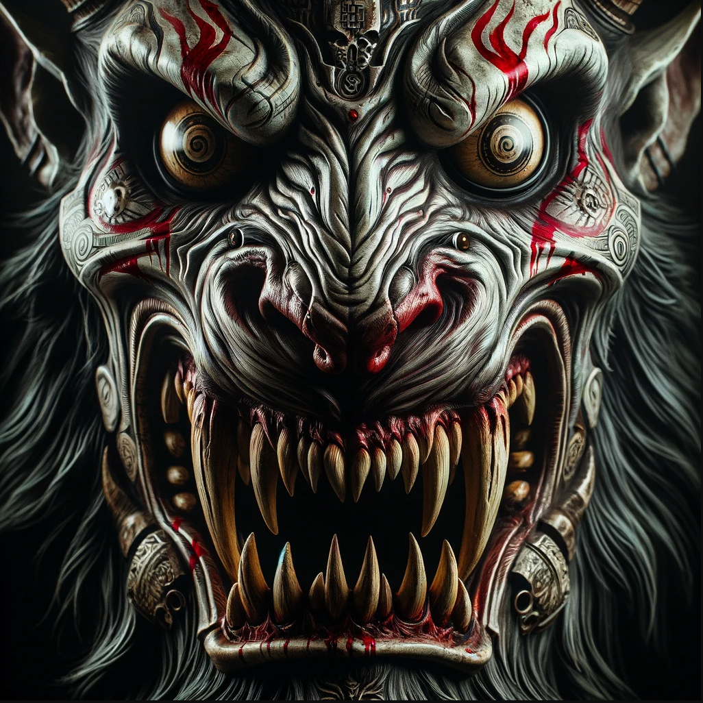

操, 后脑勺痛得我想吐. 我昨晚是又喝大了吗?

**等等!** 脸上这粗糙的摩擦感是怎么回事? 眼睛像是蒙上了一层浓雾, 什么都看不清. 一股混合着灰尘与汗渍的酸臭味直冲鼻腔

---**难不成! 是个麻袋?!**

 我猛地惊醒, 下意识地抬手想要将它扯下

---**动弹不得!**

我现在似乎被绑在...椅子上? 连脚都被固定住了?

恐惧感像一盆冷水沿着我的脊背倾倒, 让我瞬间清醒了.

**我在那?**

**什么情况? 我现在被人绑架了? 为什么?** 

我试着强迫自己冷静, 让我好好想想究竟发生了什么...

能回想到失去意识前最后的记忆是下班回家的道路, 好像突然眼前一黑. 可恶! 现在过去多久了?

**"滋啦啦啦------"**

身旁传来巨大铁门被拉开的巨大噪音打断了我的思绪. 与此同时, 些许光亮通过铁门照了进来, 尽管被套着头套, 但通过稀疏的孔洞似乎隐隐约约能看到一个高壮的人影走了进来, 铁链摩擦地面的声响也让人不寒而栗. 那个大汉似乎拖拽着什么东西然后只听**"砰"**的一声, 他将那个东西摔倒了我身前的桌子上.

"嗨! 兄...兄弟" 我试着让我的声音镇定, 但不由自主的颤抖出卖了我,"我们之间...是不是有什么误会? 你看我们能不能换个...更加舒服的方式好好商量?" 

但这个大个子似乎像是没有听到我说的话, 没有停下他的动作. 回应我的除了他沉重的呼吸声, 还有桌上逐渐出现的火光, 他是在点蜡烛?

 "兄弟, 我不知道你是谁,也不知道你为谁服务. 我保证如果你放了我..." 我努力回想有关我家附近的帮派势力, 我该不会卷进了**血疤帮**的器官交易了吧. 在意识到这点后, 我牙齿的打颤已经让我说不清下一句话, 

大个子依旧无视我, 踱步到铁门口. 

**"滋啦啦啦------砰!"** 

他拉上这沉重的铁门, 屋内的光亮只剩下他刚点上的蜡烛. 但是他沉重的呼吸声还在, 他的脚步声也表明他在缓缓向我走来. 

随着头套被掀开, 首先映入眼帘的是大个子戴着一个诡异的面具, 好似一个龇牙咧嘴且面目狰狞的野兽, 在烛光闪烁下, 显得尤为渗人. 镇静同我的尖叫声一起从我的咽喉不受控制地溜了出来. 

也就是在我嘴巴张大放声尖叫后的一瞬, 这个大个子将一个湿润的抹布塞进了我的嘴中, 一股恶心腐烂的味道直冲鼻腔, 泪水也被这股味道熏得夺眶而出, 而舌尖接触到这抹布后传来的酸苦味更是一种煎熬.  

**"血, 口水, 胆汁, 内脏, 尸臭..."**

大脑疯狂地检索着词汇, 试图理解这味道背后的含义. 每一个词, 都像一块块冰冷的拼图, 拼凑出了一个令人绝望的事实----**我, 绝不是他第一个受害者**

大个子塞完抹布后, 转身走向那张桌子. 这时候我才看清他的全貌, 他所戴的面具周围还有浓密的兽毛将他的脑袋完全覆盖, 几乎要将身上那件帆布围裙撑裂, 围裙上溅满了各种形态的**污迹**---**深褐的是陈旧的血痂, 暗红的是未干的黏腻. 还有一丝可疑的黄绿色,像是腐败的体液**。

借着那微弱的, 跳动的烛光, 我的视线绝望地追随着他, 最终落在了桌面上那团黢黑的物体上.

那...竟然是一头**黑山羊.**

**“砰!”**

第一声巨响让我全身为之一颤, 屠夫挥起一把厚重的大砍刀, 刀口精准地陷进羊的关节. 那不是切割, 是**爆破性的解体**。

**"砰!...砰!...砰!...砰!..."**

巨响在这狭小的黑屋中回荡, 每一下随着砍刀落下, 都伴随骨骼碎裂的**"咔嚓"**声, 转眼那头黑羊早已失去了形状.

在这个桌子底下, 有个巨大的铁通, 承接着黑羊碎肉块儿流下的血水.

直到我回过神来. 那屠夫已经提着满是**黑羊血**的铁桶走到我的身前. 

**"通!"** 

他猛地一踩地上的某个机关, 我甚至根本没看清那有什么, 就听见脚下传来一声沉默的金属咬合声

我的双臂被一股平稳且冷酷的机械力量强行向着身体俩侧拖拽, 抬起.

我所有的挣扎在这机械的力量面前犹如蜉蝣撼树. 关节被拉伸, 肌肉传来了撕扯的酸痛感, 我的胸腔被迫完全打开, 挺起, 将最脆弱的地方暴露无遗.

当机械剩停止是, 我的双臂已经被水平展开, 固定在一个完美的**"T"**字形上, 冰冷的金属部件紧紧锁住我的手腕, 纹丝不动. 

屠夫用手沾了沾那新鲜的黑羊血, 开始在我的身上绘制神秘的符号, 先是胸腔, 再是额头, 最后是我的左手. 特别是我的左手, 他涂抹了很多. 

他一边绘制一边用他低沉的嗓音咏唱祷告词, 神奇的是, 我明明从未听闻过这些祷告词甚至不知道属于什么语言, 但我却理解其中的含义. 

"**亚利斯塔, 亚加利塔"** 	(至上邪神, 吾为汝仆)

**"乌萨奇利, 邦巴亚奇"** 	(吾将为汝, 献上祭礼)

 **"阿提拉! 撒奇拉!" **	     (此祭非凡, 乃为献美)

**"奴哇嘟嘟卡! 亚拉玛奇卡!"** (愿汝欢愉, 愿恩赐降)

念完主祷词的屠夫开始放声大笑, 他粗暴地将我口中的抹布取下, 我正想骂他疯子.

**"砰!"** **"啊啊啊啊啊啊啊啊!!!"** **"哈哈哈哈哈哈哈哈"**

伴随着屠夫的手起刀落, 手腕处传来的剧痛让我放声大叫, 而他在那放声大笑.

还未等我从痛苦中反应过来, 他已经拖拽着我的椅子朝后走去. 

何等的蛮力, 金属椅子在地上拖拽的**"滋啦"**声刺耳异常, 就像用手指甲挂玻璃那般让人刺耳又难受. 

很快我被拖进一个更加黑暗的黑屋中, 他合上了这黑屋的大门, 一丝光亮都透不过来. 

在这伸手不见五指的黑暗中, 我从刚才断手的痛苦中稍微缓和了过来.

**这个疯子到底要干嘛?**

说来也奇怪, 在彻底的黑暗中, 我的感官聚焦在了我的左手, 并不是那种整个手掌在哪痛, 只有手腕处痛得发烫, 手掌则好像遁入虚空. 我尝试了一下握拳, 但第一次感觉到了"无"这个感觉, 好像整个手掌漂浮在一个感知不到的位置

一道强光打断了我的思绪,突然的强光让我眼睛刺痛, 下意识闭上了眼, 等我慢慢睁开眼, 却看到了无数个我, 无数个被绑在椅子上的我, 无数个被绑在椅子上左手断掉的我?

**冷静, 越是这种情况越要冷静**

我摆动我的头, 左右环顾了一下, 很快我便了解了这个房间的结构. 

整个房间是由三面镜子为墙构成的, 刚才的强光来自头上的电灯泡, 无数个"我"也只是镜面中的反射罢了. 在这个房间中, 并没有任何其他的物品, 似乎只是我和我的镜面反射们. 

**"哈哈哈哈哈哈哈"**

我可能也是疯了, 看清这屠夫三镜房间的诡计后, 我竟然也开始放声大笑. 我开始尝试蠕动我的左臂, 因为看来失去了我的手掌后, 左臂能靠蠕动挣脱束缚. 

我全神贯注, 在蠕动我的左臂, 一次次尝试能否从这个束缚中抽出, 但诡异的是就在我蠕动的过程中, 我的手掌似乎在一片虚无中触碰到了什么, 我小心翼翼用已经不存在的手掌去摸, 那个形状好像是一把匕首?

**"啊啊啊啊啊啊啊啊"**

在我还没搞明白为啥我的手掌还能传来摸到匕首的触感后, 一声与我别无二致的惨叫撕裂了寂静. 远处的一个镜像, 竟已挣脱束缚, 手中不知从何而来的匕首, 狠狠刺进了另一个“**我**”的胸膛.

**不对!**

这并非孤例, 视线所及, 噩梦正在增殖. 另一个镜像将手探进自己左腕的断口, 也抽出了一把匕首. 它挣脱束缚后, 毫不犹豫地将利刃送进了另一个"**我**"的胸膛.

惨叫声开始此起彼伏, 像一场由无数个我共同出演的屠杀合唱. 挣脱的镜像越来越多, 它们唯一的行动,就是杀死身旁还未挣脱的“**我**”.

我紧闭双眼, 安慰自己这一切都是幻想, 却听到了很多的"我"临终前的惨叫与遗憾的呢喃. 哪些惨叫和呢喃, 逐渐与我脑海中的声音同频.

**"可恶啊, 明明事业上刚有点起色"**

**"早知道这样, 今早出门时就该吃掉那碗妈妈包的馄饨了"**

**"阿黄的狗粮...我好像忘了倒满. 这条傻狗会不会一直饿着肚子, 在空碗边傻等? "**

**"要是我再勇敢点就好了, 那条爱心项链就不会躺在抽屉里三个月, 好想给她, 好想告诉她"**

...

惨叫声和心声都停了, 幻觉应该都消失了吧

我眯着眼, 慢慢观察周围.

**这一切居然都不是幻觉**

其他被捆绑的"**我**"都已经死去,无数个"**我**"举着匕首围着我虎视眈眈. 

我明白了, 最后的祭品是我自己...

无数刀刃将我刺穿, 意识逐渐消散

黑暗, 终于来了. 

